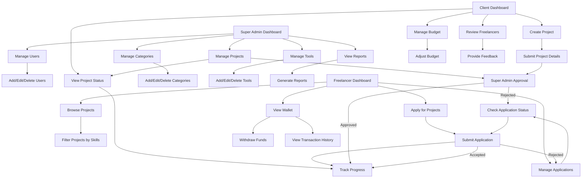

# Gawe Freelancer

[](LICENSE)

## Table of Contents

1. [Prerequisites](#prerequisites)
2. [Technologies Used](#technologies-used)
3. [Installation](#installation)
4. [Contributing](#contributing)
5. [ERD Explanation](#erd-explanation)
6. [Application Flowchart](#application-flowchart)

## Prerequisites

Before you begin, ensure you have met the following requirements:

- **PHP 8.x**: Required for running Laravel 11.
- **Composer**: Dependency management for PHP.
- **Node.js & npm**: Required for frontend assets and tooling.
- **MySQL 8**: Database management system.
- **Git**: Version control system.

## Technologies Used

- **Laravel 11**: A PHP framework for web artisans.
- **MySQL 8**: Relational database management system.
- **Breeze**: A minimal and simple Laravel starter kit for authentication.
- **Spatie**: A Laravel package for handling roles and permissions.

## Installation

1. **Clone the Repository**

   ```
   git clone https://github.com/adrianramadhan/gawe-freelancer-webapp.git
   cd gawe-freelancer-webapp
   ```
2. **Install Dependencies**
   ```
   composer install
   npm install
   ```
3. **Environment Setup**
   ```
    cp .env.example .env
   ```
4. **Generate Application Key**
   ```
    php artisan key:generate
   ```
5. **Run Migrations**
   ```
    php artisan migrate
   ```
6. **Run the Application**
   ```
    php artisan serve
    npm run dev
   ```

## Contributing
1. **Fork the Repository**
2. **Create a New Branch**
   ```
   git checkout -b feature/your-feature-name
   ```
4. **Make Changes**
5. **Commit Changes**
   ```
   git commit -m "Add some feature"
   ```
7. **Push to Branch**
   ```
   git push origin feature/your-feature-name
   ```
9. **Create a Pull Request**

## ERD Explanation


The database schema consists of the following main tables:
- users: Stores user details such as name, email, password, etc.
- projects: Contains project information like name, budget, category, etc.
- categories: Holds different project categories.
- tools: Lists various tools used in projects.
- project_tools: Pivot table connecting projects with tools.
- project_applicants: Stores information about freelancers applying for projects.
- wallets: Manages user wallet balances.
- wallet_transactions: Logs transactions related to user wallets.
- roles and permissions: Handles user roles and permissions using Spatie.

## Key Relationships
- projects are linked to categories (each project belongs to one category).
- users can apply to projects via project_applicants.
- users can have multiple roles and permissions through pivot tables.
- wallets are associated with users, with transaction details in wallet_transactions.
- tools are associated with projects through project_tools.

## Application Flowchart
Below is the flowchart of the application's primary processes:

